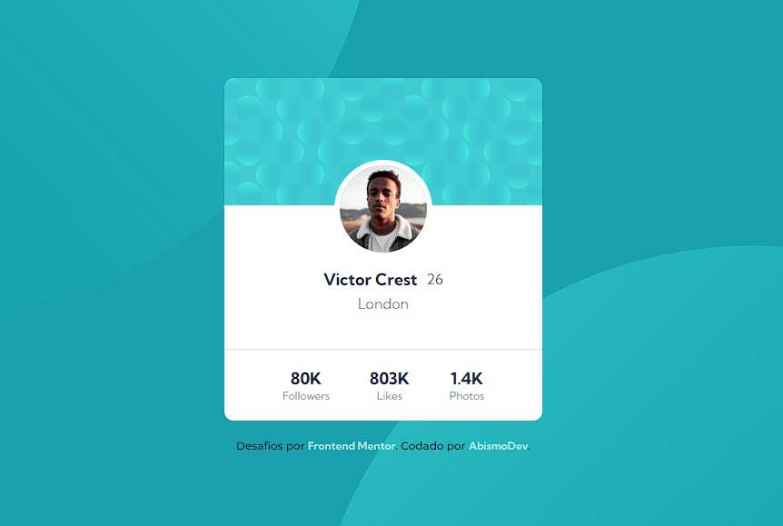

# Frontend Mentor - Profile card component solution

This is a solution to the [Profile card component challenge on Frontend Mentor](https://www.frontendmentor.io/challenges/profile-card-component-cfArpWshJ). Frontend Mentor challenges help you improve your coding skills by building realistic projects. 

## Table of contents

- [Overview](#overview)
  - [The challenge](#the-challenge)
  - [Screenshot](#screenshot)
  - [Links](#links)
- [My process](#my-process)
  - [Built with](#built-with)
- [Author](#author)

## Overview

### The challenge

- Build out the project to the designs provided

### Screenshot

### Links

- Solution URL: [Solution here](https://www.frontendmentor.io/solutions/profile-card-component-12eGbeeSq5)
- Live Site URL: [Live site here](https://profile-card-component-abismodev.vercel.app/)

## My process

### Built with

- Semantic HTML5 markup
- Styled with CSS3
- Flexbox
- Resposive

## Author

- Website - In construction
- Frontend Mentor - [@AbismoDev](https://www.frontendmentor.io/profile/AbismoDev)
- Instragam- [@AbismoDev](https://www.instagram.com/AbismoDev)